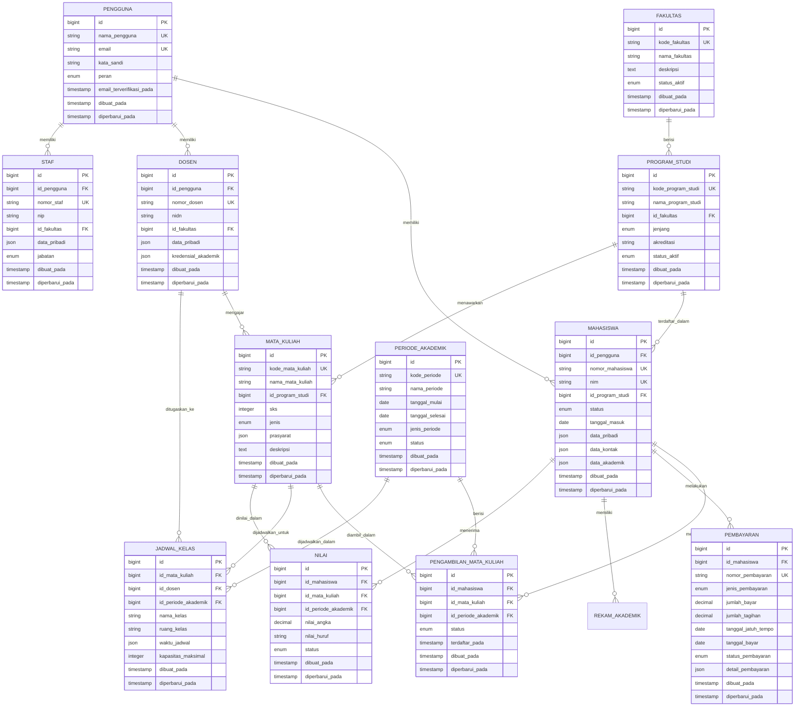

# University Academic Information System (SIA) - Comprehensive Design

## Overview

The University Academic Information System (SIA) is a comprehensive web-based platform designed to manage the complete academic lifecycle of students from initial registration through graduation. The system integrates with external platforms like PDDIKTI and provides comprehensive management tools for students, faculty, and administrative staff.

### Core Objectives
- Complete student lifecycle management
- Integrated academic record keeping
- Real-time reporting and analytics
- External system integration (PDDIKTI, DIKTI, etc.)
- Multi-role access control
- Comprehensive academic workflow automation

## Technology Stack & Dependencies

### Backend Framework
- **Framework**: Laravel 10+ (PHP)
- **Database**: MySQL 8.0+
- **Authentication**: Laravel Sanctum/Passport
- **Queue System**: Redis
- **File Storage**: Laravel Storage (Local/S3)
- **API Documentation**: Swagger/OpenAPI

### Frontend Framework
- **Framework**: Vue.js 3 with Composition API
- **UI Library**: Quasar Framework
- **State Management**: Pinia
- **Routing**: Vue Router 4
- **HTTP Client**: Axios
- **Form Validation**: VeeValidate

### Integration & External Services
- **PDDIKTI Integration**: REST API Client
- **Payment Gateway**: Midtrans/Xendit
- **Email Service**: Laravel Mail (SMTP)
- **SMS Gateway**: Twilio/Zenziva
- **PDF Generation**: DomPDF/mPDF
- **Excel Processing**: PhpSpreadsheet

## Architecture

### System Architecture Overview


### Arsitektur Database



## Arsitektur Komponen

### Hierarki Komponen Frontend


### Spesifikasi Komponen

#### Komponen Inti

**TataLetakUtama.vue**
- Props: Tidak ada
- State: `sidebarTerbuka`, `notifikasi`, `profilPengguna`
- Methods: `toggleSidebar()`, `keluar()`, `muatNotifikasi()`
- Lifecycle: `mounted()` - Inisialisasi sesi pengguna

**FormMahasiswa.vue**
- Props: `idMahasiswa?: number`, `mode: 'buat' | 'edit'`
- State: `dataForm`, `errorValidasi`, `sedangSubmit`
- Methods: `validasiForm()`, `submitForm()`, `uploadDokumen()`
- Events: `@submit`, `@cancel`

**ManagerPengambilan.vue**
- Props: `idPeriodeAkademik: number`
- State: `mataKuliahTersedia`, `mataKuliahDiambil`, `batasanPengambilan`
- Methods: `ambilMataKuliah()`, `batalkanMataKuliah()`, `cekPrasyarat()`
- Computed: `mataKuliahLayak`, `totalSKS`

## API Endpoints Reference

### Endpoint Autentikasi

| Method | Endpoint | Deskripsi | Auth Diperlukan |
|--------|----------|-----------|----------------|
| POST | `/api/auth/masuk` | Autentikasi pengguna | Tidak |
| POST | `/api/auth/keluar` | Logout pengguna | Ya |
| POST | `/api/auth/refresh` | Refresh token | Ya |
| GET | `/api/auth/saya` | Ambil pengguna saat ini | Ya |
| POST | `/api/auth/lupa-kata-sandi` | Permintaan reset kata sandi | Tidak |
| POST | `/api/auth/reset-kata-sandi` | Reset kata sandi | Tidak |

### Endpoint Manajemen Mahasiswa

| Method | Endpoint | Deskripsi | Auth Diperlukan |
|--------|----------|-----------|----------------|
| GET | `/api/mahasiswa` | Daftar mahasiswa dengan paginasi | Ya |
| POST | `/api/mahasiswa` | Buat mahasiswa baru | Ya |
| GET | `/api/mahasiswa/{id}` | Ambil detail mahasiswa | Ya |
| PUT | `/api/mahasiswa/{id}` | Update informasi mahasiswa | Ya |
| DELETE | `/api/mahasiswa/{id}` | Soft delete mahasiswa | Ya |
| GET | `/api/mahasiswa/{id}/rekam-akademik` | Ambil rekam akademik mahasiswa | Ya |
| GET | `/api/mahasiswa/{id}/transkrip` | Generate transkrip | Ya |
| POST | `/api/mahasiswa/{id}/dokumen` | Upload dokumen mahasiswa | Ya |

### Endpoint Manajemen Akademik

| Method | Endpoint | Deskripsi | Auth Diperlukan |
|--------|----------|-----------|----------------|
| GET | `/api/mata-kuliah` | Daftar semua mata kuliah | Ya |
| POST | `/api/mata-kuliah` | Buat mata kuliah baru | Ya |
| GET | `/api/mata-kuliah/{id}` | Ambil detail mata kuliah | Ya |
| PUT | `/api/mata-kuliah/{id}` | Update mata kuliah | Ya |
| GET | `/api/pengambilan-mata-kuliah` | Daftar pengambilan mata kuliah | Ya |
| POST | `/api/pengambilan-mata-kuliah` | Buat pengambilan mata kuliah | Ya |
| PUT | `/api/pengambilan-mata-kuliah/{id}` | Update status pengambilan | Ya |
| GET | `/api/nilai` | Daftar nilai dengan filter | Ya |
| POST | `/api/nilai` | Submit nilai | Ya |
| PUT | `/api/nilai/{id}` | Update nilai | Ya |

### Contoh Skema Request/Response

**Request Pembuatan Mahasiswa**
```json
{
  "data_pribadi": {
    "nama_lengkap": "Ahmad Sutanto",
    "tanggal_lahir": "2000-01-15",
    "tempat_lahir": "Jakarta",
    "jenis_kelamin": "laki-laki",
    "agama": "islam",
    "kewarganegaraan": "indonesia"
  },
  "data_kontak": {
    "email": "ahmad.sutanto@example.com",
    "telepon": "+6281234567890",
    "alamat": {
      "jalan": "Jl. Contoh No. 123",
      "kota": "Jakarta",
      "provinsi": "DKI Jakarta",
      "kode_pos": "12345"
    }
  },
  "data_akademik": {
    "id_program_studi": 1,
    "tahun_masuk": 2024,
    "jenis_masuk": "reguler",
    "sekolah_menengah": {
      "nama": "SMA Contoh",
      "tahun_lulus": 2023
    }
  }
}
```

**Response Mahasiswa**
```json
{
  "data": {
    "id": 1,
    "nomor_mahasiswa": "2024010001",
    "nim": "24010001",
    "status": "aktif",
    "tanggal_masuk": "2024-08-01",
    "data_pribadi": { /* ... */ },
    "data_kontak": { /* ... */ },
    "data_akademik": { /* ... */ },
    "program_studi": {
      "id": 1,
      "nama": "Teknik Informatika",
      "fakultas": "Teknik"
    },
    "dibuat_pada": "2024-08-01T10:00:00Z",
    "diperbarui_pada": "2024-08-01T10:00:00Z"
  }
}
```

## Model Data & Mapping ORM

### Model Inti

**Model Mahasiswa**
```php
class Mahasiswa extends Model
{
    protected $table = 'mahasiswa';
    
    protected $fillable = [
        'id_pengguna', 'nomor_mahasiswa', 'nim', 'id_program_studi',
        'status', 'tanggal_masuk', 'data_pribadi', 'data_kontak', 'data_akademik'
    ];
    
    protected $casts = [
        'data_pribadi' => 'array',
        'data_kontak' => 'array',
        'data_akademik' => 'array',
        'tanggal_masuk' => 'date'
    ];
    
    public function pengguna(): BelongsTo
    {
        return $this->belongsTo(Pengguna::class, 'id_pengguna');
    }
    
    public function programStudi(): BelongsTo
    {
        return $this->belongsTo(ProgramStudi::class, 'id_program_studi');
    }
    
    public function pengambilanMataKuliah(): HasMany
    {
        return $this->hasMany(PengambilanMataKuliah::class, 'id_mahasiswa');
    }
    
    public function nilai(): HasMany
    {
        return $this->hasMany(Nilai::class, 'id_mahasiswa');
    }
    
    public function pembayaran(): HasMany
    {
        return $this->hasMany(Pembayaran::class, 'id_mahasiswa');
    }
}
```

**Model Mata Kuliah**
```php
class MataKuliah extends Model
{
    protected $table = 'mata_kuliah';
    
    protected $fillable = [
        'kode_mata_kuliah', 'nama_mata_kuliah', 'id_program_studi', 
        'sks', 'jenis', 'prasyarat', 'deskripsi'
    ];
    
    protected $casts = [
        'prasyarat' => 'array'
    ];
    
    public function programStudi(): BelongsTo
    {
        return $this->belongsTo(ProgramStudi::class, 'id_program_studi');
    }
    
    public function pengambilanMataKuliah(): HasMany
    {
        return $this->hasMany(PengambilanMataKuliah::class, 'id_mata_kuliah');
    }
    
    public function jadwalKelas(): HasMany
    {
        return $this->hasMany(JadwalKelas::class, 'id_mata_kuliah');
    }
}
```

**Model Dosen**
```php
class Dosen extends Model
{
    protected $table = 'dosen';
    
    protected $fillable = [
        'id_pengguna', 'nomor_dosen', 'nidn', 'id_fakultas',
        'data_pribadi', 'kredensial_akademik'
    ];
    
    protected $casts = [
        'data_pribadi' => 'array',
        'kredensial_akademik' => 'array'
    ];
    
    public function pengguna(): BelongsTo
    {
        return $this->belongsTo(Pengguna::class, 'id_pengguna');
    }
    
    public function fakultas(): BelongsTo
    {
        return $this->belongsTo(Fakultas::class, 'id_fakultas');
    }
    
    public function mataKuliah(): HasMany
    {
        return $this->hasMany(MataKuliah::class, 'id_dosen');
    }
}
```

## Arsitektur Lapisan Logika Bisnis

### Modul Manajemen Mahasiswa


### Academic Process Flow


### Grade Management Workflow


## Routing & Navigation

### Struktur Route Frontend

```javascript
const routes = [
  {
    path: '/',
    component: () => import('layouts/TataLetakUtama.vue'),
    children: [
      {
        path: '',
        name: 'dasbor',
        component: () => import('pages/Dasbor.vue'),
        meta: { perluAuth: true }
      },
      {
        path: '/mahasiswa',
        name: 'mahasiswa',
        component: () => import('pages/mahasiswa/IndeksMahasiswa.vue'),
        meta: { perluAuth: true, peran: ['admin', 'staf'] }
      },
      {
        path: '/mahasiswa/buat',
        name: 'buat-mahasiswa',
        component: () => import('pages/mahasiswa/BuatMahasiswa.vue'),
        meta: { perluAuth: true, peran: ['admin', 'staf'] }
      },
      {
        path: '/mahasiswa/:id',
        name: 'detail-mahasiswa',
        component: () => import('pages/mahasiswa/DetailMahasiswa.vue'),
        meta: { perluAuth: true }
      },
      {
        path: '/akademik/mata-kuliah',
        name: 'mata-kuliah',
        component: () => import('pages/akademik/IndeksMataKuliah.vue'),
        meta: { perluAuth: true }
      },
      {
        path: '/akademik/pengambilan',
        name: 'pengambilan',
        component: () => import('pages/akademik/IndeksPengambilan.vue'),
        meta: { perluAuth: true }
      },
      {
        path: '/keuangan/pembayaran',
        name: 'pembayaran',
        component: () => import('pages/keuangan/IndeksPembayaran.vue'),
        meta: { perluAuth: true }
      },
      {
        path: '/laporan',
        name: 'laporan',
        component: () => import('pages/laporan/IndeksLaporan.vue'),
        meta: { perluAuth: true, peran: ['admin', 'staf'] }
      }
    ]
  },
  {
    path: '/auth',
    component: () => import('layouts/TataLetakAuth.vue'),
    children: [
      {
        path: 'masuk',
        name: 'masuk',
        component: () => import('pages/auth/Masuk.vue')
      },
      {
        path: 'lupa-kata-sandi',
        name: 'lupa-kata-sandi',
        component: () => import('pages/auth/LupaKataSandi.vue')
      }
    ]
  }
]
```

## State Management

### Struktur Pinia Store

```javascript
// stores/mahasiswa.js
export const useMahasiswaStore = defineStore('mahasiswa', () => {
  const mahasiswa = ref([])
  const mahasiswaSaatIni = ref(null)
  const sedangMemuat = ref(false)
  const halaman = ref({
    halaman_saat_ini: 1,
    per_halaman: 20,
    total: 0
  })
  
  const ambilMahasiswa = async (params = {}) => {
    sedangMemuat.value = true
    try {
      const response = await api.get('/mahasiswa', { params })
      mahasiswa.value = response.data.data
      halaman.value = response.data.meta
    } catch (error) {
      console.error('Error mengambil mahasiswa:', error)
    } finally {
      sedangMemuat.value = false
    }
  }
  
  const buatMahasiswa = async (dataMahasiswa) => {
    sedangMemuat.value = true
    try {
      const response = await api.post('/mahasiswa', dataMahasiswa)
      mahasiswa.value.push(response.data.data)
      return response.data.data
    } catch (error) {
      throw error
    } finally {
      sedangMemuat.value = false
    }
  }
  
  return {
    mahasiswa: readonly(mahasiswa),
    mahasiswaSaatIni: readonly(mahasiswaSaatIni),
    sedangMemuat: readonly(sedangMemuat),
    halaman: readonly(halaman),
    ambilMahasiswa,
    buatMahasiswa
  }
})
```

## External System Integration

### Arsitektur Integrasi PDDIKTI


### Integrasi Payment Gateway


## Strategi Testing

### Framework Unit Testing

```javascript
// tests/components/FormMahasiswa.test.js
describe('Komponen FormMahasiswa', () => {
  let wrapper
  
  beforeEach(() => {
    wrapper = mount(FormMahasiswa, {
      props: {
        mode: 'buat'
      },
      global: {
        plugins: [createTestingPinia()]
      }
    })
  })
  
  test('validasi field wajib', async () => {
    const tombolSubmit = wrapper.find('[data-test="tombol-submit"]')
    await tombolSubmit.trigger('click')
    
    expect(wrapper.find('[data-test="error-nama"]').exists()).toBe(true)
    expect(wrapper.find('[data-test="error-email"]').exists()).toBe(true)
  })
  
  test('submit form dengan data valid', async () => {
    await wrapper.find('[data-test="input-nama"]').setValue('Ahmad Sutanto')
    await wrapper.find('[data-test="input-email"]').setValue('ahmad@example.com')
    
    const tombolSubmit = wrapper.find('[data-test="tombol-submit"]')
    await tombolSubmit.trigger('click')
    
    expect(wrapper.emitted('submit')).toBeTruthy()
  })
})
```

### Framework Testing Backend

```php
class MahasiswaControllerTest extends TestCase
{
    use RefreshDatabase;
    
    public function test_dapat_membuat_mahasiswa()
    {
        $pengguna = Pengguna::factory()->create(['peran' => 'admin']);
        $programStudi = ProgramStudi::factory()->create();
        
        $dataMahasiswa = [
            'data_pribadi' => [
                'nama_lengkap' => 'Ahmad Sutanto',
                'tanggal_lahir' => '2000-01-15',
                'tempat_lahir' => 'Jakarta',
                'jenis_kelamin' => 'laki-laki'
            ],
            'data_kontak' => [
                'email' => 'ahmad@example.com',
                'telepon' => '+6281234567890'
            ],
            'data_akademik' => [
                'id_program_studi' => $programStudi->id,
                'tahun_masuk' => 2024
            ]
        ];
        
        $response = $this->actingAs($pengguna)
            ->postJson('/api/mahasiswa', $dataMahasiswa);
        
        $response->assertStatus(201)
            ->assertJsonStructure([
                'data' => [
                    'id',
                    'nomor_mahasiswa',
                    'nim',
                    'data_pribadi',
                    'data_kontak',
                    'data_akademik'
                ]
            ]);
        
        $this->assertDatabaseHas('mahasiswa', [
            'data_pribadi->nama_lengkap' => 'Ahmad Sutanto'
        ]);
    }
    
    public function test_validasi_field_wajib()
    {
        $pengguna = Pengguna::factory()->create(['peran' => 'admin']);
        
        $response = $this->actingAs($pengguna)
            ->postJson('/api/mahasiswa', []);
        
        $response->assertStatus(422)
            ->assertJsonValidationErrors([
                'data_pribadi.nama_lengkap',
                'data_kontak.email',
                'data_akademik.id_program_studi'
            ]);
    }
}
```

### Testing Integrasi

```php
class MahasiswaPengambilanMataKuliahIntegrationTest extends TestCase
{
    use RefreshDatabase;
    
    public function test_alur_pengambilan_mata_kuliah_lengkap()
    {
        // Setup
        $mahasiswa = Mahasiswa::factory()->create();
        $mataKuliah = MataKuliah::factory()->create(['sks' => 3]);
        $periodeAkademik = PeriodeAkademik::factory()->create(['status' => 'aktif']);
        
        // Test pengambilan mata kuliah
        $response = $this->actingAs($mahasiswa->pengguna)
            ->postJson('/api/pengambilan-mata-kuliah', [
                'id_mata_kuliah' => $mataKuliah->id,
                'id_periode_akademik' => $periodeAkademik->id
            ]);
        
        $response->assertStatus(201);
        
        // Verifikasi pengambilan dibuat
        $this->assertDatabaseHas('pengambilan_mata_kuliah', [
            'id_mahasiswa' => $mahasiswa->id,
            'id_mata_kuliah' => $mataKuliah->id,
            'status' => 'terdaftar'
        ]);
        
        // Test submit nilai
        $dosen = Dosen::factory()->create();
        $response = $this->actingAs($dosen->pengguna)
            ->postJson('/api/nilai', [
                'id_mahasiswa' => $mahasiswa->id,
                'id_mata_kuliah' => $mataKuliah->id,
                'id_periode_akademik' => $periodeAkademik->id,
                'nilai_angka' => 3.5,
                'nilai_huruf' => 'B+'
            ]);
        
        $response->assertStatus(201);
        
        // Verifikasi perhitungan IPK
        $mahasiswa->refresh();
        $this->assertEquals(3.5, $mahasiswa->ipk);
    }
}
```

## Keamanan Sistem

### Autentikasi dan Otorisasi

```php
// Middleware untuk kontrol akses berbasis peran
class PeriksaPeranMiddleware
{
    public function handle($request, Closure $next, ...$peran)
    {
        if (!auth()->check()) {
            return response()->json(['pesan' => 'Tidak terautentikasi'], 401);
        }
        
        $penggunaSaatIni = auth()->user();
        
        if (!in_array($penggunaSaatIni->peran, $peran)) {
            return response()->json(['pesan' => 'Akses ditolak'], 403);
        }
        
        return $next($request);
    }
}
```

### Enkripsi Data Sensitif

```php
// Enkripsi data pribadi mahasiswa
class Mahasiswa extends Model
{
    protected $casts = [
        'data_pribadi' => 'encrypted:array',
        'data_kontak' => 'encrypted:array'
    ];
    
    // Accessor untuk data yang sudah didekripsi
    public function getDataPribadiTerdekripsiAttribute()
    {
        return decrypt($this->data_pribadi);
    }
}
```

### Validasi Input dan Sanitasi

```php
class MahasiswaRequest extends FormRequest
{
    public function rules()
    {
        return [
            'data_pribadi.nama_lengkap' => 'required|string|max:255|regex:/^[a-zA-Z\s]+$/',
            'data_pribadi.tanggal_lahir' => 'required|date|before:today',
            'data_kontak.email' => 'required|email|unique:mahasiswa,data_kontak->email',
            'data_kontak.telepon' => 'required|regex:/^\+62[0-9]{9,12}$/',
            'nim' => 'required|unique:mahasiswa,nim|regex:/^[0-9]{8}$/'
        ];
    }
    
    public function authorize()
    {
        return auth()->user()->peran === 'admin' || auth()->user()->peran === 'staf';
    }
}
```

## Optimasi Performa

### Strategi Caching

```php
// Service untuk cache data mahasiswa
class MahasiswaService
{
    public function ambilMahasiswaCache($id)
    {
        return Cache::remember("mahasiswa.{$id}", 3600, function () use ($id) {
            return Mahasiswa::with(['programStudi', 'nilai', 'pembayaran'])
                ->find($id);
        });
    }
    
    public function hapusCacheMahasiswa($id)
    {
        Cache::forget("mahasiswa.{$id}");
        Cache::forget("daftar_mahasiswa");
    }
}
```

### Optimasi Database

```sql
-- Index untuk performa query
CREATE INDEX idx_mahasiswa_program_studi ON mahasiswa(id_program_studi);
CREATE INDEX idx_mahasiswa_status ON mahasiswa(status);
CREATE INDEX idx_nilai_mahasiswa_periode ON nilai(id_mahasiswa, id_periode_akademik);
CREATE INDEX idx_pembayaran_status ON pembayaran(status_pembayaran);
CREATE INDEX idx_pengambilan_periode ON pengambilan_mata_kuliah(id_periode_akademik);

-- Partisi tabel untuk data besar
CREATE TABLE nilai_2024 PARTITION OF nilai
FOR VALUES FROM ('2024-01-01') TO ('2025-01-01');
```

### Queue Jobs untuk Proses Berat

```php
// Job untuk sinkronisasi PDDIKTI
class SinkronisasiPDDIKTIJob implements ShouldQueue
{
    use Dispatchable, InteractsWithQueue, Queueable, SerializesModels;
    
    protected $mahasiswa;
    
    public function __construct(Mahasiswa $mahasiswa)
    {
        $this->mahasiswa = $mahasiswa;
    }
    
    public function handle()
    {
        try {
            $client = new PDDIKTIClient();
            $response = $client->kirimDataMahasiswa([
                'nim' => $this->mahasiswa->nim,
                'nama' => $this->mahasiswa->data_pribadi['nama_lengkap'],
                'program_studi' => $this->mahasiswa->programStudi->kode_program_studi
            ]);
            
            $this->mahasiswa->update([
                'status_sinkronisasi_pddikti' => 'berhasil',
                'terakhir_sinkronisasi' => now()
            ]);
            
        } catch (Exception $e) {
            Log::error('Gagal sinkronisasi PDDIKTI: ' . $e->getMessage());
            
            $this->mahasiswa->update([
                'status_sinkronisasi_pddikti' => 'gagal'
            ]);
        }
    }
}
```

## Monitoring dan Logging

### Sistem Logging

```php
// Custom log channel untuk audit
class AuditLogger
{
    public static function logAktivitasMahasiswa($mahasiswa, $aktivitas, $detail = [])
    {
        Log::channel('audit')->info('Aktivitas Mahasiswa', [
            'id_mahasiswa' => $mahasiswa->id,
            'nim' => $mahasiswa->nim,
            'aktivitas' => $aktivitas,
            'detail' => $detail,
            'ip_address' => request()->ip(),
            'user_agent' => request()->userAgent(),
            'timestamp' => now()->toISOString()
        ]);
    }
}

// Middleware untuk logging request
class LogRequestMiddleware
{
    public function handle($request, Closure $next)
    {
        $response = $next($request);
        
        Log::channel('requests')->info('API Request', [
            'method' => $request->method(),
            'url' => $request->fullUrl(),
            'ip' => $request->ip(),
            'user_id' => auth()->id(),
            'response_status' => $response->status(),
            'duration' => microtime(true) - LARAVEL_START
        ]);
        
        return $response;
    }
}
```

### Health Check Endpoints

```php
// Controller untuk monitoring kesehatan sistem
class HealthCheckController extends Controller
{
    public function index()
    {
        $checks = [
            'database' => $this->cekDatabase(),
            'redis' => $this->cekRedis(),
            'storage' => $this->cekStorage(),
            'pddikti_api' => $this->cekPDDIKTIAPI()
        ];
        
        $status = collect($checks)->every(fn($check) => $check['status'] === 'ok')
            ? 'healthy' 
            : 'unhealthy';
        
        return response()->json([
            'status' => $status,
            'timestamp' => now()->toISOString(),
            'checks' => $checks
        ]);
    }
    
    private function cekDatabase()
    {
        try {
            DB::select('SELECT 1');
            return ['status' => 'ok', 'message' => 'Database terhubung'];
        } catch (Exception $e) {
            return ['status' => 'error', 'message' => 'Database tidak terhubung'];
        }
    }
}
```

## Deployment dan DevOps

### Docker Configuration

```dockerfile
# Dockerfile untuk aplikasi Laravel
FROM php:8.2-fpm

# Install dependencies
RUN apt-get update && apt-get install -y \
    git \
    curl \
    libpng-dev \
    libonig-dev \
    libxml2-dev \
    zip \
    unzip

# Install PHP extensions
RUN docker-php-ext-install pdo_mysql mbstring exif pcntl bcmath gd

# Install Composer
COPY --from=composer:latest /usr/bin/composer /usr/bin/composer

# Set working directory
WORKDIR /var/www

# Copy application files
COPY . /var/www

# Install PHP dependencies
RUN composer install --no-interaction --optimize-autoloader

# Set permissions
RUN chown -R www-data:www-data /var/www
RUN chmod -R 755 /var/www/storage

EXPOSE 9000
CMD ["php-fpm"]
```

### Docker Compose untuk Development

```yaml
# docker-compose.yml
version: '3.8'

services:
  app:
    build:
      context: .
      dockerfile: Dockerfile
    container_name: sia-app
    restart: unless-stopped
    working_dir: /var/www
    volumes:
      - ./:/var/www
    networks:
      - sia-network
    depends_on:
      - database
      - redis

  nginx:
    image: nginx:alpine
    container_name: sia-nginx
    restart: unless-stopped
    ports:
      - "80:80"
    volumes:
      - ./:/var/www
      - ./docker/nginx.conf:/etc/nginx/conf.d/default.conf
    networks:
      - sia-network
    depends_on:
      - app

  database:
    image: mysql:8.0
    container_name: sia-mysql
    restart: unless-stopped
    environment:
      MYSQL_DATABASE: sia_database
      MYSQL_ROOT_PASSWORD: rahasia123
      MYSQL_USER: sia_user
      MYSQL_PASSWORD: sia_password
    volumes:
      - mysql_data:/var/lib/mysql
    ports:
      - "3306:3306"
    networks:
      - sia-network

  redis:
    image: redis:alpine
    container_name: sia-redis
    restart: unless-stopped
    ports:
      - "6379:6379"
    networks:
      - sia-network

volumes:
  mysql_data:

networks:
  sia-network:
    driver: bridge
```

### CI/CD Pipeline

```yaml
# .github/workflows/deploy.yml
name: Deploy SIA Application

on:
  push:
    branches: [ main ]
  pull_request:
    branches: [ main ]

jobs:
  test:
    runs-on: ubuntu-latest
    
    services:
      mysql:
        image: mysql:8.0
        env:
          MYSQL_ALLOW_EMPTY_PASSWORD: yes
          MYSQL_DATABASE: sia_test
        ports:
          - 3306:3306
        options: --health-cmd="mysqladmin ping" --health-interval=10s --health-timeout=5s --health-retries=3
    
    steps:
    - uses: actions/checkout@v3
    
    - name: Setup PHP
      uses: shivammathur/setup-php@v2
      with:
        php-version: '8.2'
        extensions: mbstring, xml, ctype, iconv, intl, pdo_mysql
    
    - name: Install Dependencies
      run: composer install --no-interaction --prefer-dist --optimize-autoloader
    
    - name: Generate Application Key
      run: php artisan key:generate
    
    - name: Run Database Migrations
      run: php artisan migrate --force
      env:
        DB_CONNECTION: mysql
        DB_HOST: 127.0.0.1
        DB_PORT: 3306
        DB_DATABASE: sia_test
        DB_USERNAME: root
        DB_PASSWORD: ''
    
    - name: Run Tests
      run: php artisan test
      env:
        DB_CONNECTION: mysql
        DB_HOST: 127.0.0.1
        DB_PORT: 3306
        DB_DATABASE: sia_test
        DB_USERNAME: root
        DB_PASSWORD: ''

  deploy:
    needs: test
    runs-on: ubuntu-latest
    if: github.ref == 'refs/heads/main'
    
    steps:
    - name: Deploy to Production
      uses: appleboy/ssh-action@v0.1.5
      with:
        host: ${{ secrets.HOST }}
        username: ${{ secrets.USERNAME }}
        key: ${{ secrets.KEY }}
        script: |
          cd /var/www/sia
          git pull origin main
          composer install --no-interaction --optimize-autoloader --no-dev
          php artisan migrate --force
          php artisan config:cache
          php artisan route:cache
          php artisan view:cache
          php artisan queue:restart
          sudo systemctl reload nginx
